

    
    
    

In github, i found a wonderful project --- [30DaysofSwift Project](https://github.com/allenwong/30DaysofSwift).

Unfortunately for me, i don't like StoryBoard.The project is not all built with code. The structure of StoryBoard confused me when I was studying, so I followed his project to refactor and add my own elements.
## 01 CustomFont

- understand UIApplication, UIViewController, UIView all inherit from NSObject
- UIWindow is the main window for App.
- know UIFont.familyNames and fontNames(forFamilyName: family)
- learn addTarget method (object connect with communicate event)
- using UITableViewDataSource, UITableViewDelegate protocols and their methods.

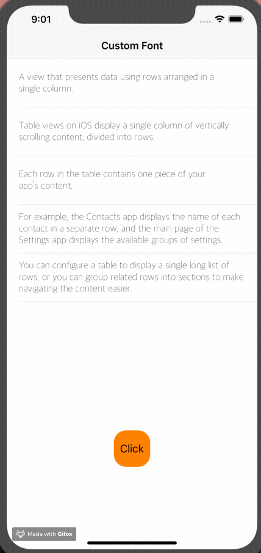

## 02 Stop Watch

- learn willSet and didSet property observer
- review addTarget method
- Timer method scheduledTimer() and invalidate()

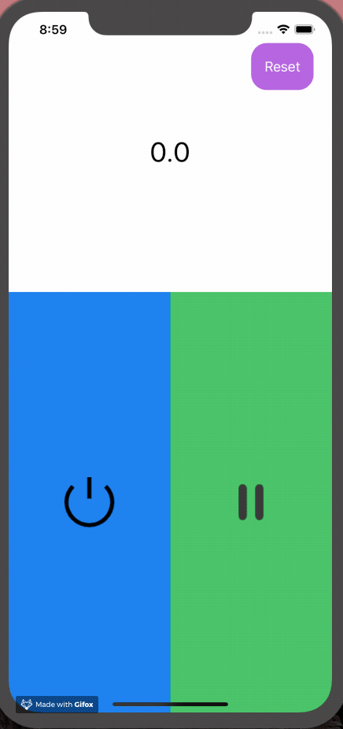

## 03 Local Video

- learn AVPlayer and AVPlayerViewController
- learn present method to push ViewController (diffrent from UINavigationController.pushViewController)
- learn customize UITableViewCell

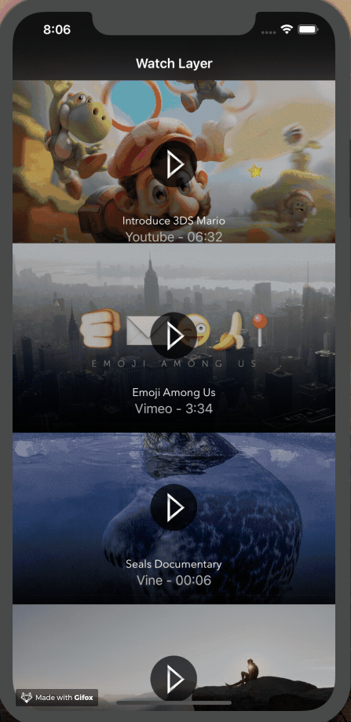

## 04 Carousel Effect

- learn UICollectionView and customize UICollectionViewCell
- use UIVisualEffectView 
- know protocol UICollectionViewDelegateFlowLayout and UIScrollViewDelegate

## 05 Find Position

- learn import CoreLocation and use instance of CLLocationManager
- know about CLLocationManagerDelegate protocol
- CLLocation convert CLGeocoder

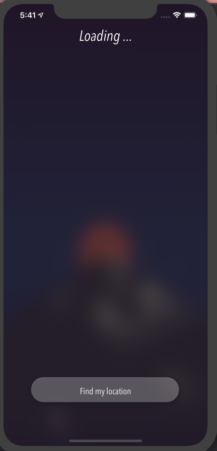

## 06 PushToRefresh

- learn UIRefreshControl
- learn append data and reload tableView
- use NSAttributedString to change text style

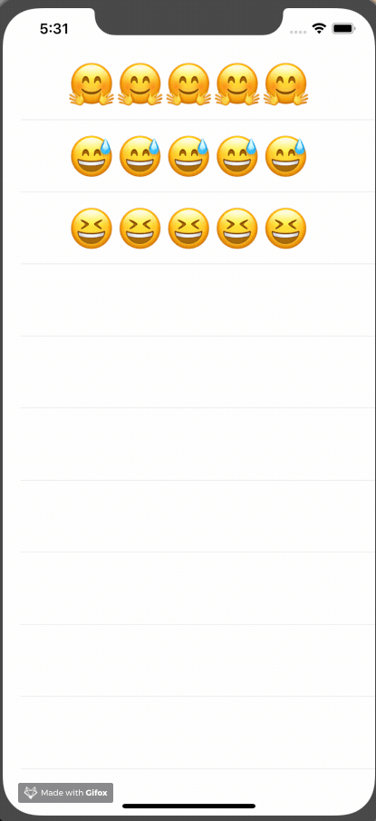

## 07 Random Color Gradient

- learn AVAudioPlayer import from AVFoundation 
- use gradientLayer and drand48()

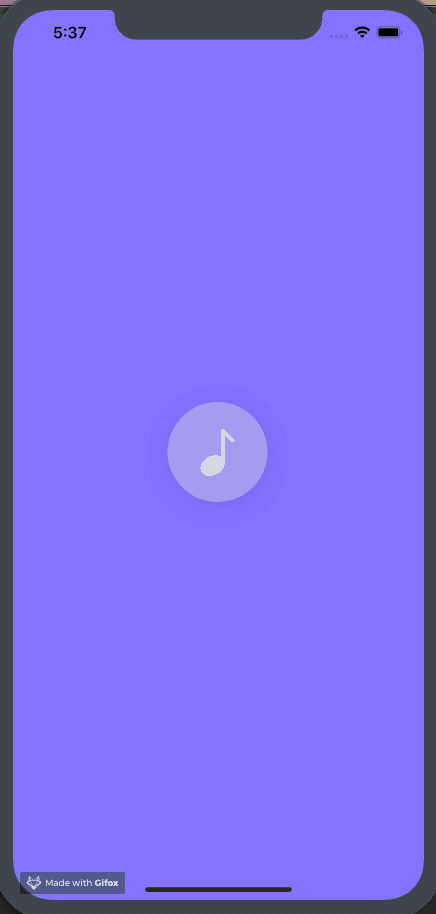

## 08 ImageScroller

- learn UIScrollView
- learn UIScrollViewDelegate (use viewForZooming method and minimumZoomScale, maximumZoomScale)

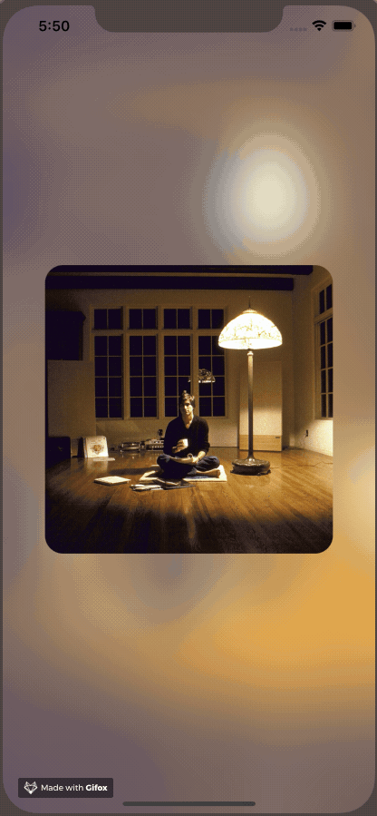

## 09 VideoBackground

- view.layer.addSubLayer(AVPlayerLayer)
- learn NotificationCenter and register observers
- know about AVPlayerItem and AVPlayerLayer

## 10 ClearCell

- review CAGradientLayer and UITableView
- set navifationBar.barStyle and navigationBar.titleTextAttributes

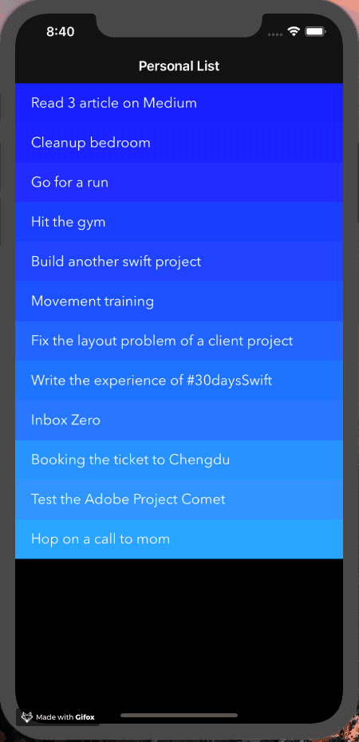

## 11 Login Animation

- study UIView.animate 
- learn about present and dismiss method

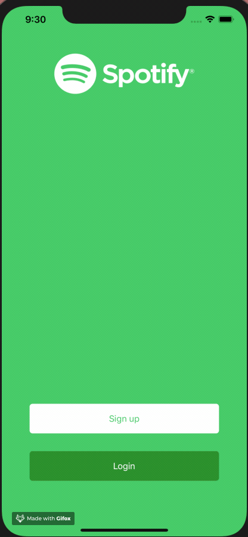

## 12 Animate TableViewCell

- review animate and connect tableViewCell
- review Clear style about Cell

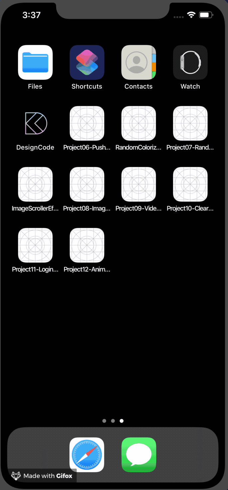

## 13 Emoji Slot Machine

- study UIPickerView and UIPickerViewDataSource UIPickerViewDelegate

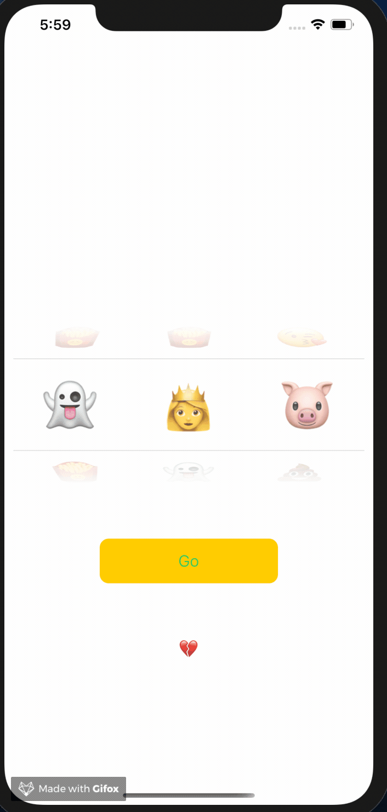

## 14 Animated Splash

- know about layer.mask 
- study CAKeyframeAnimation and CAAnimationDelegate

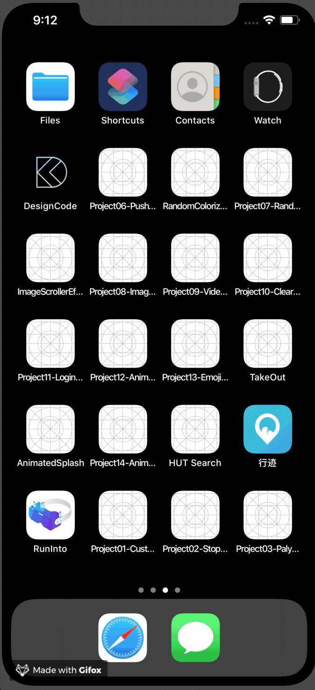

## 15 SlideMenu

- understand custom present transition animation 
- UIViewControllerAnimatedTransitioning and UIViewControllerTransitioningDelegate is really imporant

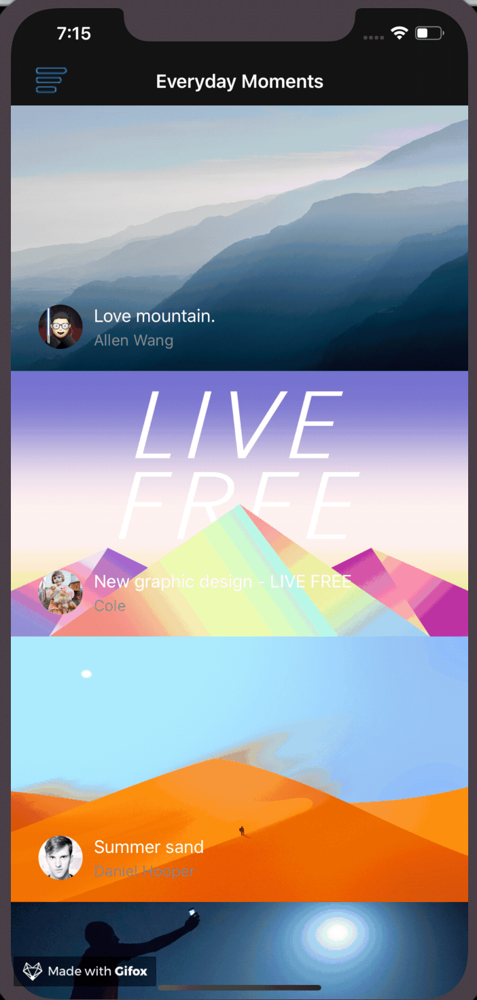

## 16 Tumblr Menu

- review custom cell, transition and UIVisualEffectView
- learn about CGAffineTransform

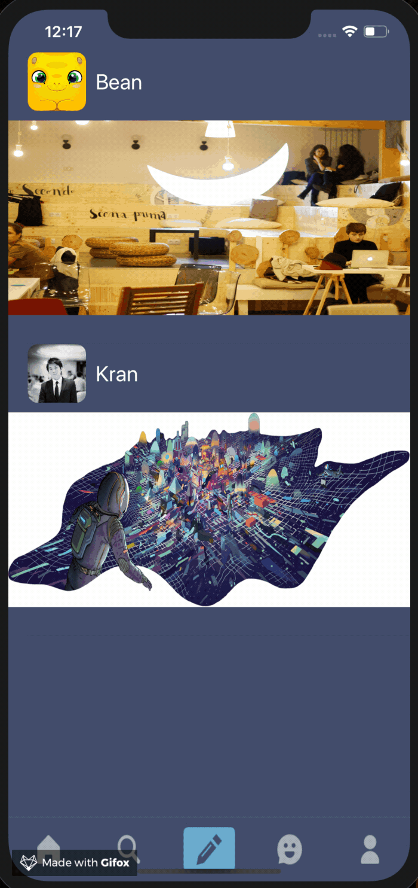

## 17 LimitTextField

- learn UITextView and limit its text count

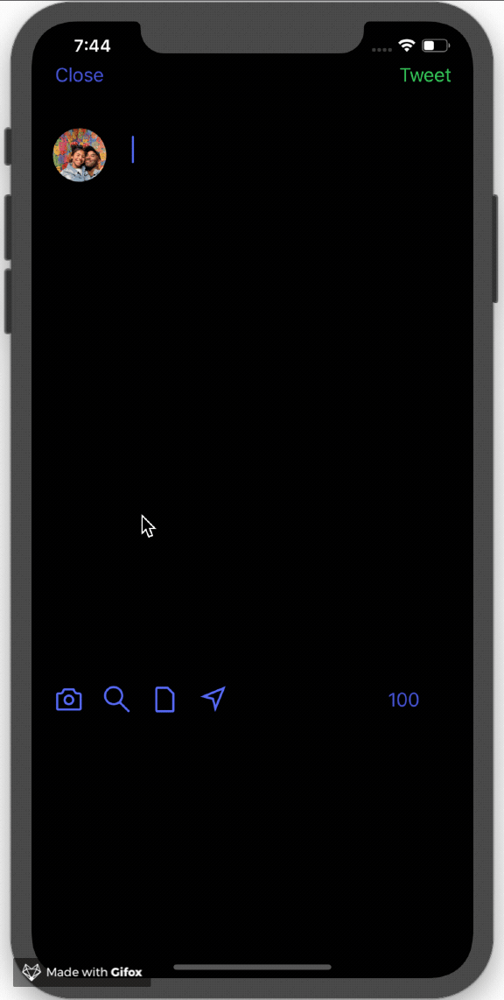

## 18 CollectionCellAnimation

- review transition animation and style like App Store Card animation

